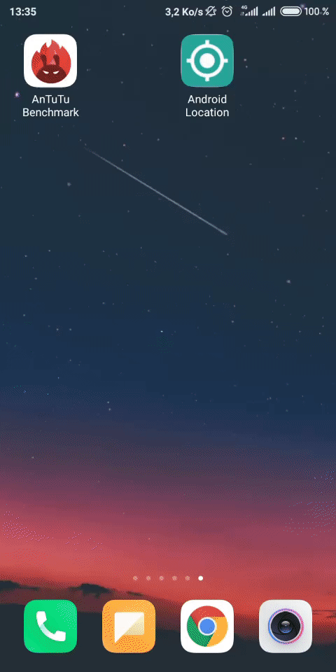

# AndroidLocation

 Sample app that shows how to get current GPS location on Android with Gmaps & Fused Location Provider API.

 <table style="width:100%">
  <tr>
    <th><b>How it works</b></th>
  </tr>
  <tr>
    <td></td>
  </tr>
  </table>

## Implementation
All you need to run the application is to generate the [Google API Key](https://console.developers.google.com/flows/enableapi?apiid=maps_android_backend&keyType=CLIENT_SIDE_ANDROID&r=7A:A8:7F:D1:2E:B1:6F:37:58:D4:F9:15:5D:D2:71:D3:8A:83:1C:9F%3Bcom.thecode.androidlocation) and enter it in AndroidManifest.xml.

## Credits
This library is built using following open-source libraries.
- [Material Components for Android](https://github.com/material-components/material-components-android)

## License
Apache 2.0 license.